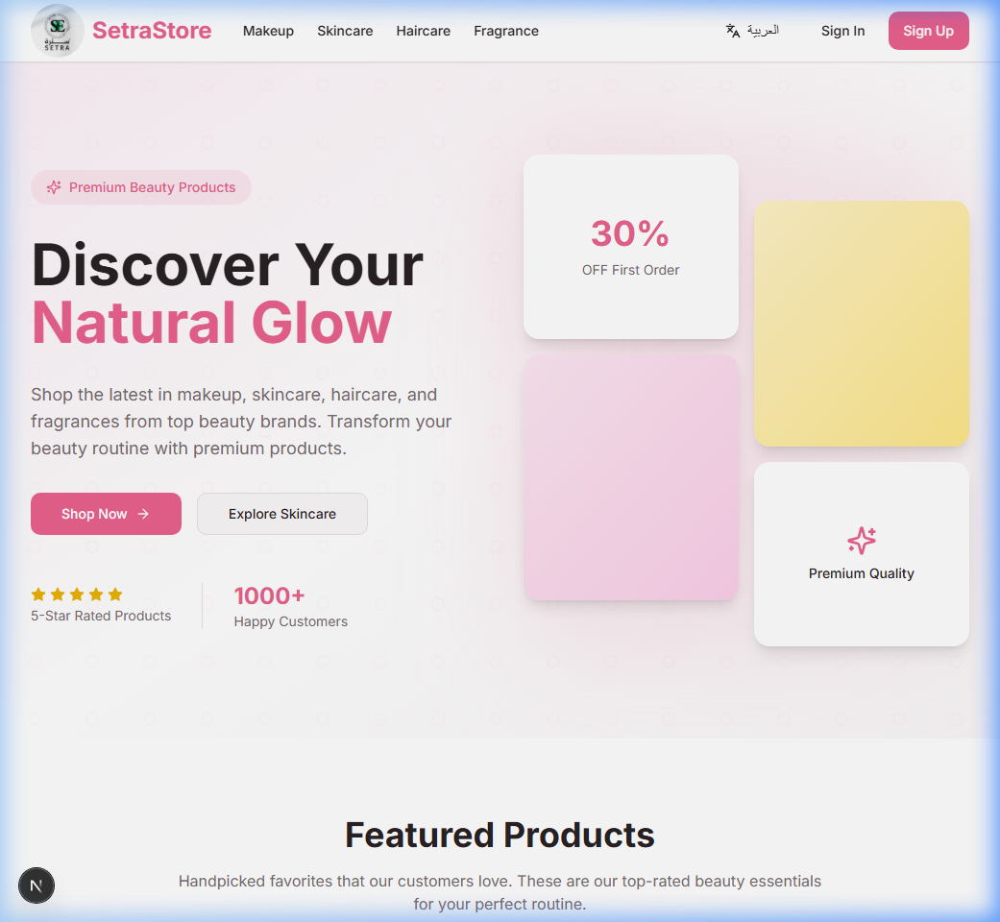
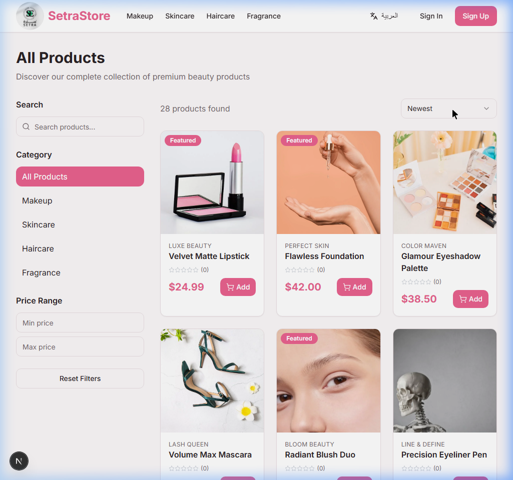

# SetraStore - E-Commerce Cosmetics Application

A modern, full-featured e-commerce application built with **Next.js 16.2.1**, **React 19**, Supabase, and TypeScript for selling cosmetics and beauty products.

## Screenshots

<div align="center">
  <h3>Home Page</h3>
  
  
  <h3>Product Listing</h3>
  
</div>

## Features

### User Features
- **Authentication**: Secure user registration and login with JWT (Supabase Auth)
- **Product Browsing**: Browse products by categories (Makeup, Skincare, Haircare, Fragrance)
- **Search & Filter**: Advanced search and filtering by price, category, and brand
- **Product Details**: Detailed product pages with images, descriptions, and customer reviews
- **Shopping Cart**: Add products to cart with quantity management
- **Wishlist**: Save favorite products for later
- **Reviews & Ratings**: Write and read product reviews with star ratings
- **Checkout**: Simple checkout process with Cash on Delivery
- **Discount Coupons**: Apply promotional codes for discounts
- **Internationalization**: Full support for English and Arabic (RTL) using `next-intl`
- **Order Tracking**: View order history and status updates

### Admin Features
- **Admin Dashboard**: Comprehensive dashboard with key metrics
- **Product Management**: Create, edit, and delete products
- **Order Management**: View and update order statuses
- **User Overview**: View total customer count and analytics

### Design Features
- **Modern UI**: Clean, feminine design with soft pink, white, and beige colors
- **Fully Responsive**: Optimized for mobile, tablet, and desktop
- **Beautiful Components**: Smooth animations and hover effects
- **Loading States**: Proper loading indicators and error handling
- **Toast Notifications**: Real-time feedback for user actions

## Tech Stack

- **Frontend**: Next.js 16.2.1 (App Router), React 19, TypeScript 5.x
- **Styling**: Tailwind CSS, shadcn/ui components
- **Backend**: Supabase (PostgreSQL database, Authentication, Real-time)
- **State Management**: React Context API
- **Form Handling**: React Hook Form with Zod validation
- **Notifications**: Sonner for toast notifications

## Database Schema

### Tables
- **profiles**: User profiles extending Supabase auth.users
- **products**: Product catalog with images, pricing, and stock
- **orders**: Customer orders with delivery information
- **order_items**: Individual items in each order
- **cart**: Shopping cart items
- **wishlist**: Saved products
- **reviews**: Product reviews and ratings
- **coupons**: Promotional discount codes

All tables have Row Level Security (RLS) enabled for data protection.

## Getting Started

### Prerequisites
- Node.js 20.9+ installed
- A Supabase account and project

### Setup Instructions

1. **Clone the repository**
   ```bash
   cd project
   ```

2. **Install dependencies**
   ```bash
   npm install
   ```

3. **Set up Supabase**
   - Create a new project at [supabase.com](https://supabase.com)
   - The database schema has been applied via migrations
   - Sample product data has been inserted

4. **Configure Environment Variables**

   Update `.env.local` with your Supabase credentials:
   ```env
   NEXT_PUBLIC_SUPABASE_URL=your_supabase_project_url
   NEXT_PUBLIC_SUPABASE_ANON_KEY=your_supabase_anon_key
   ```

   You can find these in your Supabase project settings under API.

5. **Run the development server**
   ```bash
   npm run dev
   ```

6. **Open your browser**
   Navigate to [http://localhost:3000](http://localhost:3000)

## Project Structure

```
├── app/                      # Next.js app directory
│   ├── [locale]/            # Localized routes (en/ar)
│   │   ├── admin/           # Admin dashboard
│   │   ├── cart/            # Shopping cart page
│   │   ├── checkout/        # Checkout process
│   │   ├── login/           # Authentication pages
│   │   ├── orders/          # Order management
│   │   ├── products/        # Product listing and details
│   │   ├── wishlist/        # Wishlist page
│   │   └── page.tsx         # Homepage
├── components/              # Reusable components
│   ├── ui/                  # shadcn/ui components
├── proxy.ts                 # Next.js 16 Middleware (Network Proxy)
├── i18n/                    # Internationalization configuration
└── lib/                     # Utilities and configurations
    └── supabase.ts          # Supabase client and types
```

## Sample Data

The application comes pre-populated with:
- 28 cosmetics products across all categories
- 4 active coupon codes for testing:
  - `WELCOME10` - 10% off
  - `BEAUTY20` - 20% off
  - `SPRING25` - 25% off
  - `FREESHIP` - 15% off

## Creating an Admin User

To access the admin dashboard, you need to set a user's `is_admin` flag to `true` in the database:

1. Sign up for a new account through the application
2. Go to your Supabase project
3. Navigate to Table Editor > profiles
4. Find your user and set `is_admin` to `true`
5. Log out and log back in
6. Access the admin dashboard at `/admin`

## Key Features Implementation

### Authentication
- Secure JWT-based authentication via Supabase
- Protected routes for authenticated users
- Role-based access control for admin features

### Shopping Cart
- Persistent cart stored in database
- Real-time quantity updates
- Automatic total calculations

### Checkout Process
- Simple form-based checkout
- Cash on Delivery payment option
- Coupon code validation and application
- Order confirmation with tracking

### Product Management
- Admin can add/edit/delete products
- Image URL support
- Stock management
- Featured product highlighting

### Reviews & Ratings
- Users can review purchased products
- Star rating system (1-5 stars)
- Average rating calculation
- Review counts

## Deployment

### Build for Production
```bash
npm run build
```

### Deploy to Vercel (Recommended)
1. Push your code to GitHub
2. Import the project in Vercel
3. Add environment variables
4. Deploy

### Deploy to Netlify
1. Update `netlify.toml` if needed
2. Connect your repository
3. Add environment variables
4. Deploy

## Security Features

- Row Level Security (RLS) on all database tables
- Secure authentication with Supabase
- Protected API routes
- Input validation and sanitization
- No sensitive data exposure in client code

## Future Enhancements

Potential features to add:
- Multiple payment gateways (Stripe, PayPal)
- Email notifications for orders
- Product inventory alerts
- Advanced analytics dashboard
- Social login options
- Image upload for products
- Customer support chat

## License

This project is created for educational and commercial purposes.

## Support

For issues or questions, please open an issue in the repository.

---

Built with love for beauty enthusiasts!
